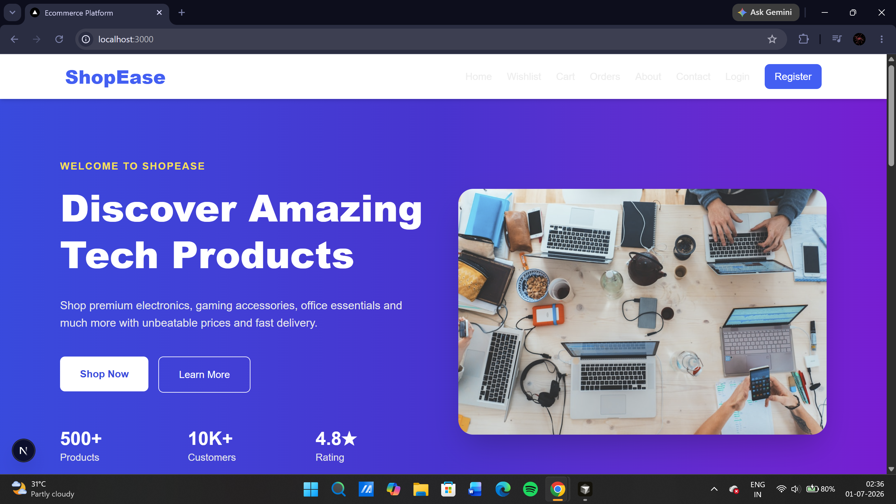
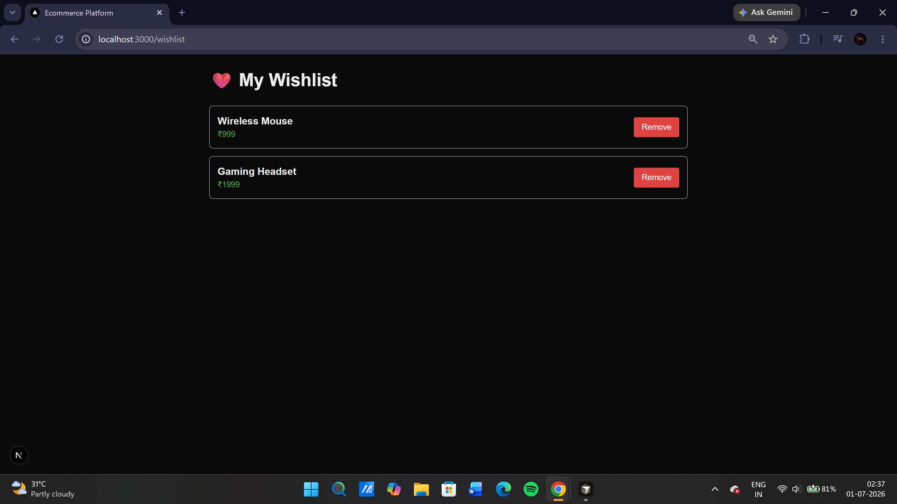
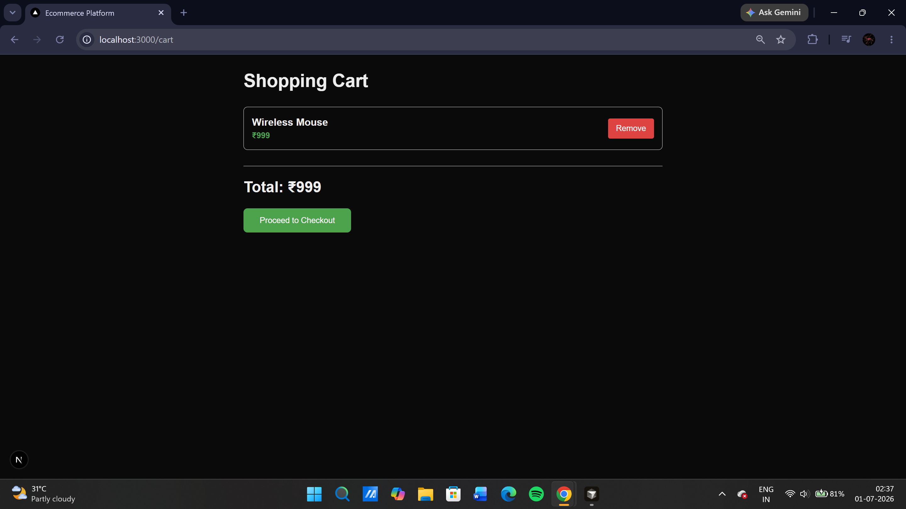
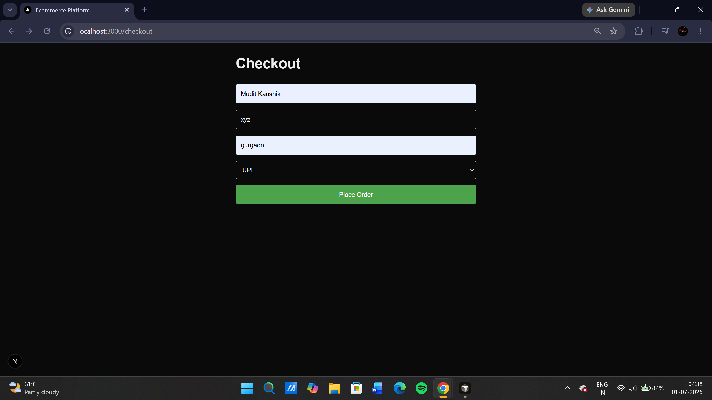
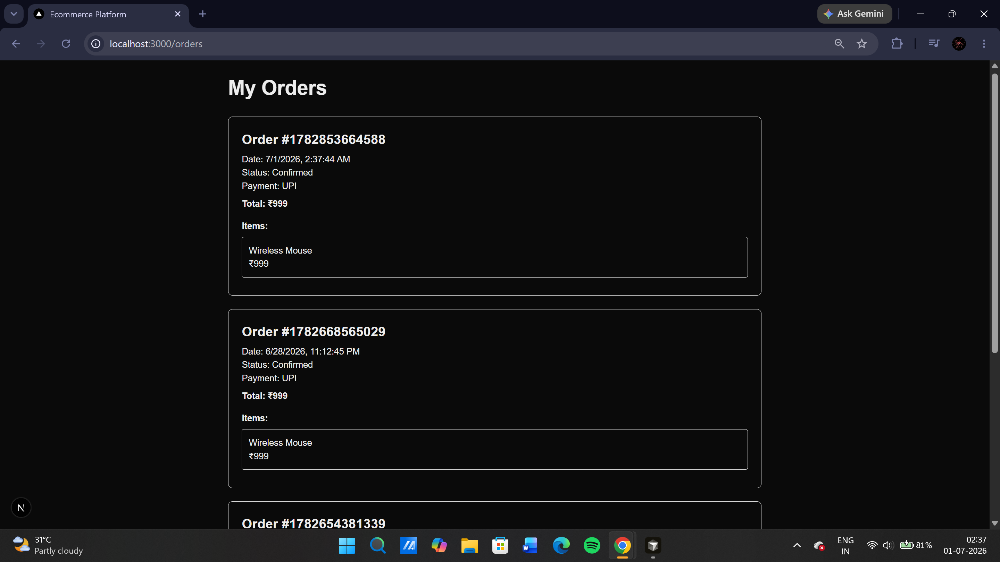

# 🛍️ ShopEase

<div align="center">

### A Modern Full-Stack E-Commerce Platform

Built with **Next.js**, **React**, **TypeScript**, **Tailwind CSS**, **Node.js**, and **Express.js**


</div>

---

## 📖 About

**ShopEase** is a modern full-stack e-commerce platform developed to demonstrate real-world web development concepts.

The application provides a complete online shopping experience including product browsing, product details, shopping cart, wishlist, checkout, user authentication (demo), order history, and responsive UI.

This project was built as a portfolio project to showcase full-stack development skills using modern technologies.

---

# ✨ Features

### 🛍 Shopping
- Browse Products (Expanded 16-item catalog)
- Product Details (Rating stars, stock badges, specifications table)
- Search Products (Real-time dynamic filtering)
- Category Filtering (Interactive gradient button selectors)

### ❤️ User Features & State
- Wishlist (Unified state, quick add/remove, "Move to Cart" utility)
- Shopping Cart (Unified state, checkout summaries, shipping thresholds, promo codes)
- Checkout (Shipping fields, payment cards, secure validation)
- Order History (Accordion receipt design with payment tracking)

### 👤 Authentication
- Demo Login (Multi-user account database logic, email validation, credentials checking)
- Demo Registration (Automatic user sign-in and direct profile routing)
- User Profile Dashboard (Avatars, quick dashboard menus, logout actions)

### 💳 Payments Integration
- **Razorpay Checkout Gateway**: Secure payment integration supporting UPI, Cards, and NetBanking in Sandbox/Test Mode.
- **Dynamic SDK Loading**: Asynchronous loading of official Razorpay SDK on-demand.
- **Prototyping Modal Fallback**: Inline mock overlay payment dialog mimicking Razorpay's checkout flow for seamless test runs when API keys are not present in `.env`.
- **Signature Verification**: Express backend cryptographic signature matching utilizing HMAC-SHA256 hashes.

### 🎨 UI/UX
- Responsive Design (Overhauled using Tailwind CSS v4)
- Sticky glassmorphic Blur Navbar with dynamic item count badges
- Plus Jakarta Sans premium typography
- Dynamic micro-interactions powered by `react-hot-toast`

---

# 🛠 Tech Stack

## Frontend
- Next.js (App Router)
- React
- TypeScript
- Tailwind CSS
- Context API
- Lucide React (Modern icon library)
- React Hot Toast (Micro-interaction alerts)

## Backend
- Node.js
- Express.js
- Razorpay Node SDK (Payment integration)

## Data Storage
- JSON Local Database (Mock Backend)
- Browser LocalStorage (Cart, Wishlist, User Accounts, and Order histories)

---

# 📂 Folder Structure

```
ShopEase
│
├── backend
│   ├── src
│   │   ├── config
│   │   ├── data
│   │   └── routes
│   ├── package.json
│   └── server.js
│
├── frontend
│   ├── app
│   ├── components
│   ├── context
│   ├── services
│   ├── public
│   └── package.json
│
├── .gitignore
└── README.md
```

---

# 📸 Screenshots

## 🏠 Home Page



```
screenshots/home.png
```

---

## 📦 Product Details


```
screenshots/product.png
```

---

## ❤️ Wishlist



```
screenshots/wishlist.png
```

---

## 🛒 Shopping Cart



```
screenshots/cart.png
```

---

## 💳 Checkout



```
screenshots/checkout.png
```

---

## 📜 Orders



```
screenshots/orders.png
```

---

# ⚙️ Installation

## Clone Repository

```bash
git clone https://github.com/MuditKaushik3117/Shopease.git
```

---

## Backend Setup

```bash
cd backend

npm install

npm run dev
```

Backend runs on

```
http://localhost:5000
```

---

## Frontend Setup

```bash
cd frontend

npm install

npm run dev
```

Frontend runs on

```
http://localhost:3000
```

---

# 🚀 Future Improvements

- MongoDB Integration
- JWT Authentication
- Admin Dashboard
- Razorpay / Stripe Payment Gateway
- Product Reviews
- Ratings
- Order Tracking
- Coupon System
- Inventory Management
- Email Notifications

---

# 📈 Learning Outcomes

This project helped me understand:

- Full Stack Development
- REST APIs
- React Context API
- State Management
- Component Based Architecture
- Routing in Next.js
- Responsive UI Design
- Client-Server Communication
- Express.js Backend Development
- Git & GitHub Workflow

---

# 👨‍💻 Author

## Mudit Kaushik

Software Developer | Cybersecurity Analyst

GitHub

https://github.com/MuditKaushik3117

LinkedIn

https://www.linkedin.com/in/mudit-kaushik-72b820299/

---

# ⭐ Show your support

If you found this project useful, consider giving it a ⭐ on GitHub!

---

<div align="center">

Made with ❤️ using Next.js & Express.js

</div>


